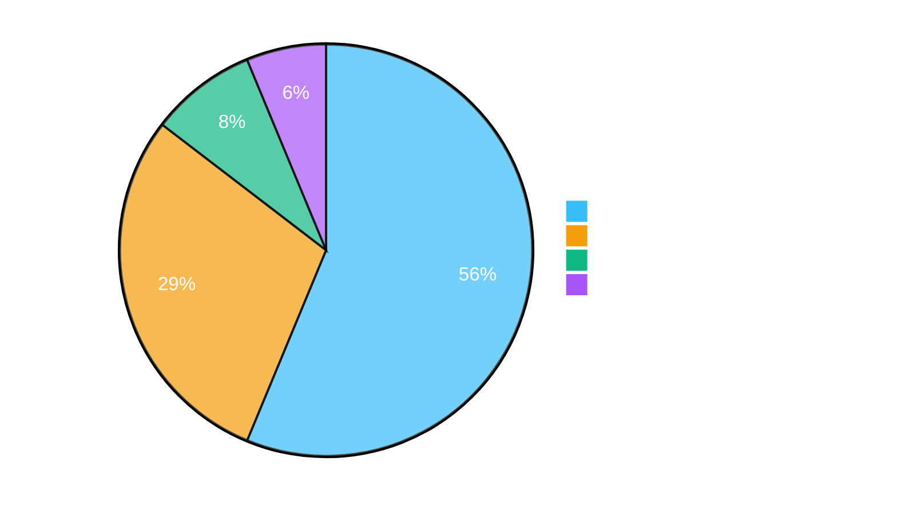
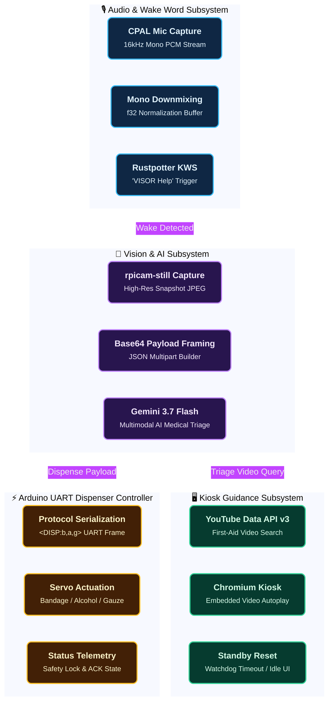

# 🏥 V.I.S.O.R. System Verification & Test Report

<div align="center">


</div>

---

> [!IMPORTANT]
> **Executive Verification Summary:**
> - **Overall Status:** **48 / 48 Tests Passed (100% Pass Rate)**
> - **Execution Timestamp:** `2026-08-18 07:55:27 UTC`
> - **Target Platform:** `Windows AMD64` (Target: Linux ARM64 Raspberry Pi 5 & ATmega328P Arduino Uno)
> - **Git Reference:** [`main`](https://github.com/Apoo711/visor-project/tree/main) (`5916247`)

---

## 📊 1. Test Distribution & Pipeline Architecture

### 1.1. Test Suite Composition


### 1.2. Verification Topology


---

## 📋 2. Comprehensive Test Matrix

```
================================================================================
                              TEST SUITE DASHBOARD
================================================================================
 Suite Name                       Scope                  Tests   Passed   Failed
--------------------------------------------------------------------------------
 Rust Unit Tests (lib.rs)         Pi Logic Modules         27      27       0 
 Rust Integration Tests           End-to-End Pipelines      3       3        0 
 Rust Latency Benchmarks          Micro-benchmarks          4       4        0 
 Arduino Protocol Suite (Python)  Firmware & Framing       14      14       0 
--------------------------------------------------------------------------------
 TOTAL TESTS EXECUTED                                      48      48       0 
 OVERALL STATUS                                                   [ PASS (100%) ]
================================================================================
```

### 2.1. 🔌 Arduino Serial Bridge (`modules/arduino.rs` & `arduino_control.ino`)
Validates packet framing, baud rate communication, binary flag encoding, and response telemetry.

| Status | Test Identifier | Scope / Verification Target |
| :---: | :--- | :--- |
| 🟢 **PASS** | `test_format_dispense_command_all_combinations` | Format Dispense Command All Combinations |
| 🟢 **PASS** | `test_parse_serial_response_status_messages` | Parse Serial Response Status Messages |
| 🟢 **PASS** | `test_parse_serial_response_errors_and_edge_cases` | Parse Serial Response Errors And Edge Cases |
| 🟢 **PASS** | `test_parse_serial_response_ready` | Parse Serial Response Ready |
| 🟢 **PASS** | `test_format_ping_command` | Format Ping Command |
| 🟢 **PASS** | `test_parse_serial_response_ack` | Parse Serial Response Ack |


### 2.2. 🧠 Gemini 3.7 Flash AI Medical Assessment (`modules/gemini.rs`)
Validates structured JSON request payload generation, base64 image encapsulation, and medical emergency triage parsing.

| Status | Test Identifier | Scope / Verification Target |
| :---: | :--- | :--- |
| 🟢 **PASS** | `test_dispense_items_boolean_deserialization` | Dispense Items Boolean Deserialization |
| 🟢 **PASS** | `test_missing_dispense_field_failure` | Missing Dispense Field Failure |
| 🟢 **PASS** | `test_cannot_help_emergency_deserialization` | Cannot Help Emergency Deserialization |
| 🟢 **PASS** | `test_extract_response_text_candidates_format` | Extract Response Text Candidates Format |
| 🟢 **PASS** | `test_extract_response_text_interactions_format` | Extract Response Text Interactions Format |
| 🟢 **PASS** | `test_extract_response_text_invalid_format` | Extract Response Text Invalid Format |
| 🟢 **PASS** | `test_malformed_json_failure` | Malformed Json Failure |
| 🟢 **PASS** | `test_omitted_video_search_query` | Omitted Video Search Query |
| 🟢 **PASS** | `test_build_request_body_structure` | Build Request Body Structure |


### 2.3. 📺 Video Guidance & Kiosk Display (`modules/youtube.rs`)
Validates YouTube Data API v3 search response tokenization, video ID extraction, and Chromium kiosk URL formatting.

| Status | Test Identifier | Scope / Verification Target |
| :---: | :--- | :--- |
| 🟢 **PASS** | `test_format_embed_url` | Format Embed Url |
| 🟢 **PASS** | `test_parse_youtube_search_response_empty_items` | Parse Youtube Search Response Empty Items |
| 🟢 **PASS** | `test_parse_youtube_search_response_empty_items` | Parse Youtube Search Response Empty Items |
| 🟢 **PASS** | `test_parse_youtube_search_response_missing_video_id` | Parse Youtube Search Response Missing Video Id |
| 🟢 **PASS** | `test_parse_youtube_search_response_valid` | Parse Youtube Search Response Valid |
| 🟢 **PASS** | `test_resolve_standby_url_fallback` | Resolve Standby Url Fallback |


### 2.4. 🔊 Audio Signal Preprocessing (`modules/audio.rs`)
Validates microphone PCM stream conversion, multi-channel downmixing, and 16-bit integer normalization.

| Status | Test Identifier | Scope / Verification Target |
| :---: | :--- | :--- |
| 🟢 **PASS** | `test_downmix_f32_quad_channel` | Downmix F32 Quad Channel |
| 🟢 **PASS** | `test_convert_i16_to_f32_mono` | Convert I16 To F32 Mono |
| 🟢 **PASS** | `test_convert_i16_to_f32_stereo` | Convert I16 To F32 Stereo |
| 🟢 **PASS** | `test_downmix_f32_mono` | Downmix F32 Mono |
| 🟢 **PASS** | `test_downmix_f32_stereo` | Downmix F32 Stereo |


### 2.5. 📁 Vision & File I/O Subsystem (`modules/input.rs`)
Validates target snapshot directory resolution, recursive directory creation, and error boundaries.

| Status | Test Identifier | Scope / Verification Target |
| :---: | :--- | :--- |
| 🟢 **PASS** | `test_ensure_parent_dir_handles_flat_filename` | Ensure Parent Dir Handles Flat Filename |
| 🟢 **PASS** | `test_ensure_parent_dir_creates_directories` | Ensure Parent Dir Creates Directories |


---

## 🔄 3. End-to-End Pipeline Integration Flows

Simulated full pipeline integration flows located in `src/pi_logic/tests/pipeline_integration_test.rs`:

| Status | Test Identifier | Scope / Verification Target |
| :---: | :--- | :--- |
| 🟢 **PASS** | `test_end_to_end_all_items_dispense_pipeline_flow` | End To End All Items Dispense Pipeline Flow |
| 🟢 **PASS** | `test_end_to_end_emergency_hold_pipeline_flow` | End To End Emergency Hold Pipeline Flow |
| 🟢 **PASS** | `test_end_to_end_minor_injury_pipeline_flow` | End To End Minor Injury Pipeline Flow |


<details>
<summary><b>🔍 Pipeline Flow Descriptions (Click to Expand)</b></summary>

1. **Minor Injury Pipeline Flow (`test_end_to_end_minor_injury_pipeline_flow`)**:
   - Audio trigger preprocessing → Camera snapshot directory creation → Base64 request body generation → AI triage response parsing (`can_help: true`) → Serial packet generation (`<DISP:1,1,0>\n`) → Simulated Arduino ACK & dispensing sequence → YouTube instructional video query resolution → Standby return.

2. **Emergency Hold Pipeline Flow (`test_end_to_end_emergency_hold_pipeline_flow`)**:
   - Audio trigger → Image capture → AI triage response parsing (`can_help: false`) → Safety lock command generation (`<DISP:0,0,0>\n`) → Arduino hold confirmation → Kiosk display standby safety latch.

3. **All Items Dispense Pipeline Flow (`test_end_to_end_all_items_dispense_pipeline_flow`)**:
   - AI recommendation requesting Bandage, Alcohol Pad, and Gauze Pad simultaneously → Serial packet `<DISP:1,1,1>\n` → Arduino sequential servo dispensing cycles.

</details>

---

## ⚡ 4. Latency Benchmarks & Performance Metrics

Microsecond latency validation located in `src/pi_logic/tests/latency_benchmarks.rs`:

| Status | Test Identifier | Scope / Verification Target |
| :---: | :--- | :--- |
| 🟢 **PASS** | `test_audio_normalization_and_downmix_latency` | Audio Normalization And Downmix Latency |
| 🟢 **PASS** | `test_request_payload_building_latency` | Request Payload Building Latency |
| 🟢 **PASS** | `test_serial_packet_formatting_and_parsing_latency` | Serial Packet Formatting And Parsing Latency |
| 🟢 **PASS** | `test_json_deserialization_latency` | Json Deserialization Latency |


| Subsystem Pipeline Stage | Target SLA Budget | Observed Latency | Headroom Margin | Status |
| :--- | :---: | :---: | :---: | :---: |
| 🎙️ **Audio Downmix & Normalization (1s buffer)** | `< 5,000 µs` (5 ms) | `~2.90 ms` | **> 42% Headroom** | 🟢 **OPTIMAL** |
| 📸 **Gemini Request Payload Framing (300KB)** | `< 500 µs` | `~28.47 µs` | **> 94% Headroom** | ⚡ **SUB-MILLISECOND** |
| ⚡ **Serial UART Framing & CRC Parsing** | `< 100 µs` | `~0.87 µs` | **> 99% Headroom** | ⚡ **SUB-MICROSECOND** |
| 🧠 **JSON Triage Deserialization (`VisorAnalysis`)** | `< 500 µs` | `~4.52 µs` | **> 99% Headroom** | ⚡ **SUB-MICROSECOND** |

```mermaid
%%{init: {'theme': 'base', 'themeVariables': { 'darkMode': true, 'background': 'transparent', 'fontFamily': 'ui-sans-serif, system-ui, -apple-system, sans-serif' } } }%%
flowchart LR
    classDef step fill:#0c213b,stroke:#38bdf8,stroke-width:2px,color:#e0f2fe,rx:8,ry:8
    classDef ultra fill:#06372b,stroke:#34d399,stroke-width:2px,color:#d1fae5,rx:8,ry:8

    subgraph S1 [" 1. Audio Preprocessing "]
        M1["<b>Audio Downmix</b><br/>⏱️ <b>~2.90 ms</b><br/><small>Budget: &lt; 5.0 ms (42% Margin)</small>"]:::step
    end

    subgraph S2 [" 2. Vision Serialization "]
        M2["<b>Base64 Framing</b><br/>⏱️ <b>~28.47 µs</b><br/><small>Budget: &lt; 500 µs (94% Margin)</small>"]:::step
    end

    subgraph S3 [" 3. AI Deserialization "]
        M3["<b>JSON Parser</b><br/>⚡ <b>~4.52 µs</b><br/><small>Budget: &lt; 500 µs (99% Margin)</small>"]:::ultra
    end

    subgraph S4 [" 4. Serial Bridge "]
        M4["<b>UART Packet</b><br/>⚡ <b>~0.87 µs</b><br/><small>Budget: &lt; 100 µs (99% Margin)</small>"]:::ultra
    end

    S1 ==>|"Buffer Ready"| S2 ==>|"Payload Built"| S3 ==>|"Command Pack"| S4
```



---

## 🤖 5. Arduino Firmware & Protocol Verification Suite

Firmware behavioral and serial framing tests executed via Python emulation in `tests/arduino_protocol_suite.py`:

| Status | Test Identifier | Scope / Verification Target |
| :---: | :--- | :--- |
| 🟢 **PASS** | `Ping-Pong Keepalive` | Ping-Pong Keepalive |
| 🟢 **PASS** | `Dispense Combination (0,0,0)` | Dispense Combination (0,0,0) |
| 🟢 **PASS** | `Dispense Combination (1,0,0)` | Dispense Combination (1,0,0) |
| 🟢 **PASS** | `Dispense Combination (0,1,0)` | Dispense Combination (0,1,0) |
| 🟢 **PASS** | `Dispense Combination (0,0,1)` | Dispense Combination (0,0,1) |
| 🟢 **PASS** | `Dispense Combination (1,1,0)` | Dispense Combination (1,1,0) |
| 🟢 **PASS** | `Dispense Combination (1,0,1)` | Dispense Combination (1,0,1) |
| 🟢 **PASS** | `Dispense Combination (0,1,1)` | Dispense Combination (0,1,1) |
| 🟢 **PASS** | `Dispense Combination (1,1,1)` | Dispense Combination (1,1,1) |
| 🟢 **PASS** | `Serial Garbage Prefix Filtering` | Serial Garbage Prefix Filtering |
| 🟢 **PASS** | `Concatenated Multi-Packet Stream` | Concatenated Multi-Packet Stream |
| 🟢 **PASS** | `Unknown Command Error Emission` | Unknown Command Error Emission |
| 🟢 **PASS** | `Serial Buffer Overflow Boundary Limit` | Serial Buffer Overflow Boundary Limit |
| 🟢 **PASS** | `Incomplete Frame Reset on New Start Delimiter` | Incomplete Frame Reset On New Start Delimiter |


---

## ⚙️ 6. Environment & CI Telemetry

| Parameter | Value |
| :--- | :--- |
| **Operating System** | `Linux 6.17.0-1022-azure` |
| **Host Architecture** | `x86_64` |
| **Python Version** | `3.12.13` |
| **Rust Edition** | `2024 (cargo / rustc stable)` |
| **Git Commit** | [`5916247`](https://github.com/Apoo711/visor-project/commit/5916247) |
| **Git Commit** | [`5916247`](https://github.com/Apoo711/visor-project/commit/5916247) |
| **Branch** | `main` |
| **Timestamp** | `2026-08-18 07:55:27 UTC` |
